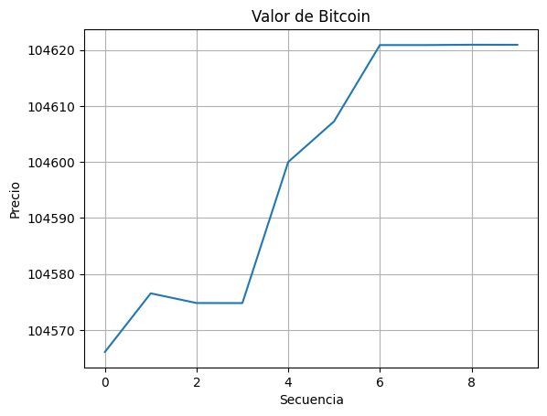

# 🪙 Bitcode

Un bot que cada cierto intervalo, este tomará decisiones basándose en las métricas que obtiene usando datos del brocker de binance.

## 🎯 Objetivo

Crear un bot Open Source que tenga la capacidad de poder tomar decisiones, priorizando el uso abierto y transparente de algoritmos conocidos para asegurar su correcto funcionamiento, cuya integración de algoritmos sea fácil y rápido para probar y analizar. 

## 👨‍💻 Análisis

Durante su desarrollo se ofrecerá una lista oficial de algoritmos que se usarán para analizar su desempeño con las métricas correspondientes.

## 📧 Contacto y soporte

Puedes mandar tus dudas, contribuciones o solicitudes a través de la interfaz de esta plataforma.

> Desarrollado con ❤️ por TechAtlasDev